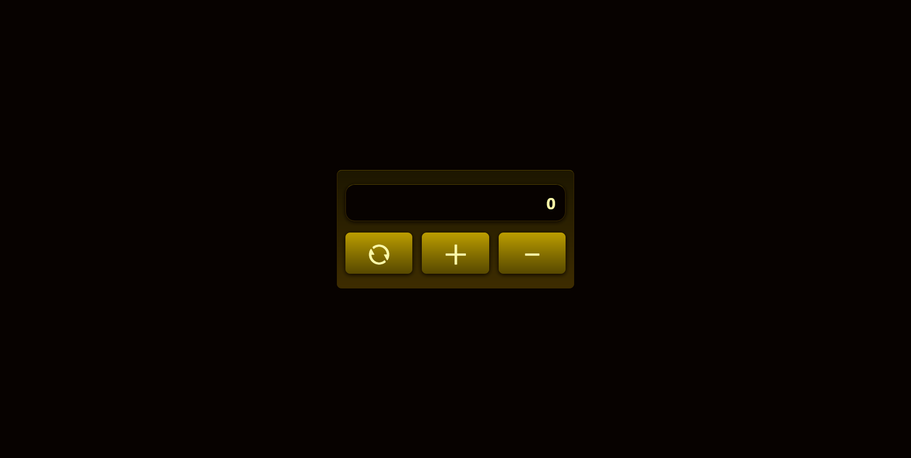

# 🔢 Counter App — Interactive UI

A simple yet polished **counter application** built using **HTML**, **SCSS**, and **JavaScript**. This project focuses on **DOM manipulation**, **event handling**, and **state management** while maintaining a clean, modern UI.

The app allows users to **increment**, **decrement**, and **reset** a counter value with smooth visual feedback and responsive interactions.

---

## ✨ Features

- ➕ **Increment counter**
- ➖ **Decrement counter**
- 🔄 **Reset counter to zero**
- 🧠 **Proper state handling** (counter variable resets correctly)
- 🎨 **Modern UI styling** using SCSS
- 🧩 **Pure JavaScript logic** (no libraries)
- ⚡ Fast, lightweight, and responsive
- 📱 Works smoothly across screen sizes

---

## 🌐 Live Demo / Review

You can view and interact with the project here:  
👉 [Counter App - Live Demo](https://harsh-codes-hub.github.io/Counter-TASK13/)

Click the buttons to increment, decrement, or reset the counter value.

---

## 🗂️ File Structure

```bash
Counter-TASK13/
│
├── index.html        # Main HTML structure
├── style.css         # Compiled CSS from SCSS
├── style.scss        # SCSS source file
├── script.js         # JavaScript logic
├── preview.webp      # Preview image
│
├── /favicon          # Website icons & manifest
│   ├── android-chrome-192x192.png
│   ├── android-chrome-512x512.png
│   ├── apple-touch-icon.png
│   ├── favicon-16x16.png
│   ├── favicon-32x32.png
│   ├── favicon.ico
│   └── site.webmanifest
│
└── README.md         # Project documentation

```

---

## 💻 Usage

1. **Clone the repository:**
   ```bash
   git clone https://github.com/Harsh-Codes-hub/Counter-TASK13.git
   ```
2. **Navigate to the project directory:**
   ```bash
   cd Counter-TASK13
   ```
3. _Open the project in your browser_
   ```
   open index.html
   ```
   or simply double-click on **index.html**

---

## 🧠 Learning Highlights

- 🔢 Implemented **counter logic using JavaScript**
- 🧠 Learned **state management** with variables
- 🖱️ Practiced **DOM selection & event listeners**
- 🔄 Understood the importance of **resetting state correctly**
- 🎨 Styled UI using **SCSS variables and gradients**
- ⚡ Built an interactive UI without external libraries

---

## 🧠 What Makes This Project Special

- 🔢 Clean and minimal **counter logic**
- 🧠 Proper handling of **increment, decrement, and reset**
- 🎨 Visually polished UI despite simple functionality
- ⚡ Lightweight and beginner-friendly
- 🧩 Strong foundation for larger JS projects

---

## 📸 Preview

_Simple counter app showcasing increment, decrement, and reset functionality._



---

## 🛠️ Built With

- 🧾 **HTML5**
- 🎨 **CSS3 / SCSS**
- 🧩 **JavaScript (DOM Manipulation)**
- 🎯 **Event Listeners**
- ⚡ **Vanilla JS Logic**

---

## 👨‍💻 Author

**Cohort 2.0 – Batch Task 13 Submission**  
Created by **Harsh Gajrani** _(Harsh Codes Hub)_  
Part of the **Cohort 2.0 batch at Sheryians Coding School**

Part of frontend layout and design practice
Focused on **JavaScript basics**, **DOM manipulation**, and **interactive UI logic**

---

_⭐ If you’re learning JavaScript fundamentals, this project is a great place to start — feel free to star the repository!_

---